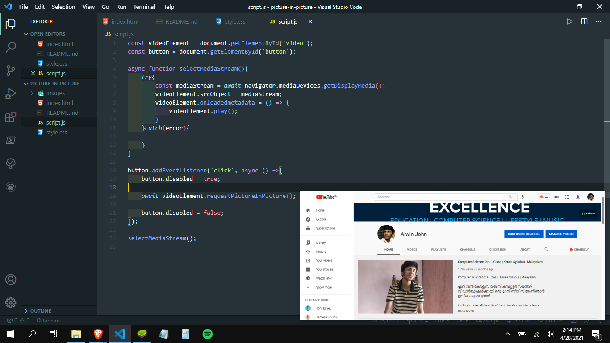

<h1><b>How to use picture-in-picture?</b></h1>

<h2><ol>
    <li>Go to this link  --> <a href="https://dexters-hub.github.io/picture-in-picture-JavaScript">Link</a></li>
     
    <li>Select the tab you want to view. Eg: Google Meet</</li>
      
    <li>Click the Start button to preview the choosen tab in picture-in-picture mode.</li>
</ol>
</h2>
<h1><b>Preview</b></h1>
    

